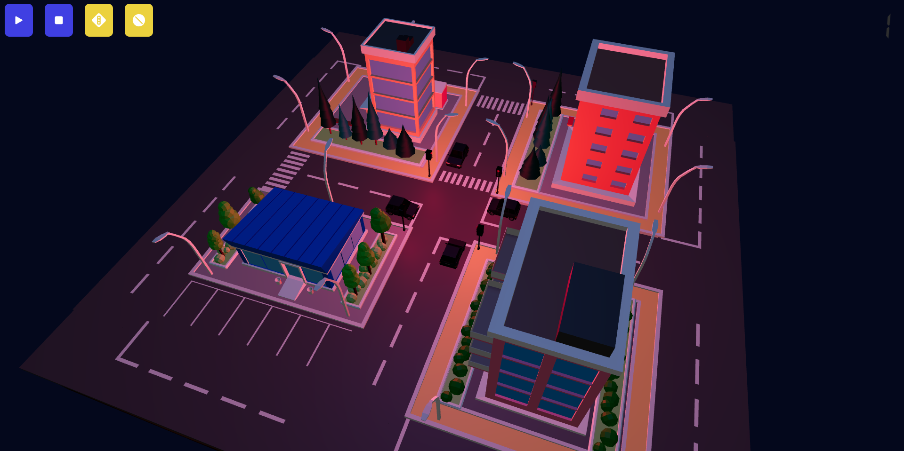

<!-- PROJECT LOGO -->
<br />
<p align="center">
  <a href="https://github.com/ZTStudios">
    
  </a>

  <h3 align="center">Traffic Control</h3>

  <p align="center">
    Desarrollo de aplicacion para la materia de sistemas programables
    <br />
  </p>
</p>

<!-- ABOUT THE PROJECT -->
## Sobre el proyecto
<p align="center">
  
</p>

En este proyecto, se desarrolló una aplicación web 3D utilizando React y Three.js que consiste en un crucero de carros y semáforos. La aplicación incluye una vista 3D del crucero con vehículos en movimiento y semáforos que regulan el tráfico.

Para crear la escena 3D, se utilizaron modelos 3D de alta calidad de vehículos, semáforos y otros objetos relacionados con la temática de la aplicación. Se ajustaron texturas y efectos de iluminación para lograr un efecto realista en la escena.

La aplicación también incluye una interfaz de usuario interactiva desarrollada con React que permite al usuario controlar los semáforos y ver cómo el cambio de su estado afecta al flujo del tráfico.

Además, se incluyó una función de cámara que permite al usuario moverse alrededor del crucero y observar los cruceros de cerca.

### Stack de desarrollo
This section should list any major frameworks that you built your project using. Leave any add-ons/plugins for the acknowledgements section. Here are a few examples.
* [React js](https://getbootstrap.com)
* [Three js](https://jquery.com)
* [Vite](https://laravel.com)


## Instalacion

1. Clona el repositorio
```sh
git clone https://github.com/bryantg1221/traffic-control.git
```
2. Instalacion de las dependencias de `NPM`
```sh
npm install
```
3. Inicializa la aplicacion en el entorno: `dev`
```sh
npm run dev
```
